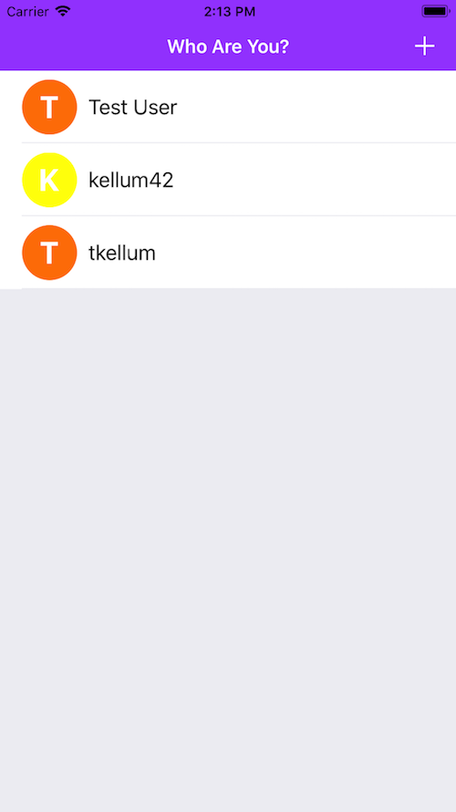
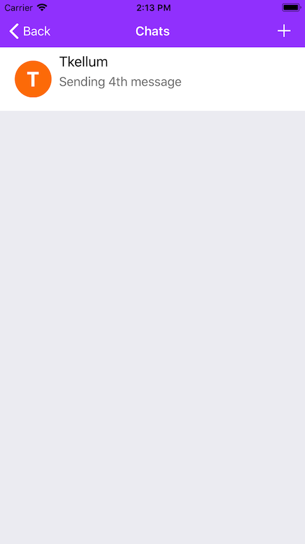
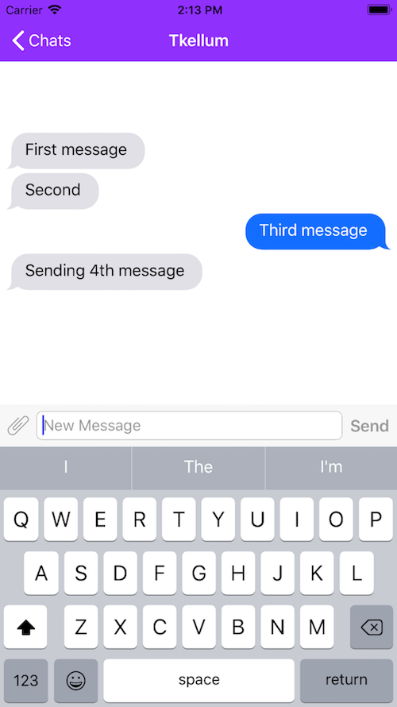

# AllHBCU_Messenger

#### A basic messenging app. Uses [JSQMessagesViewController](https://github.com/jessesquires/JSQMessagesViewController) for the chat controller and [cloud firestore](https://firebase.google.com/docs/firestore/) as the backend.

